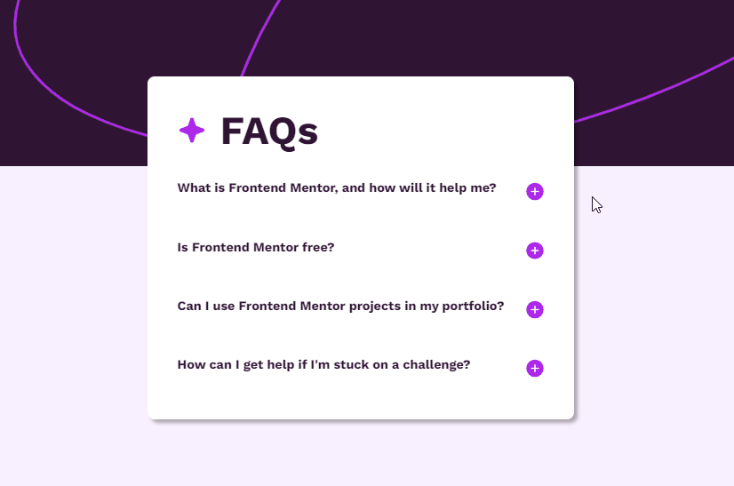
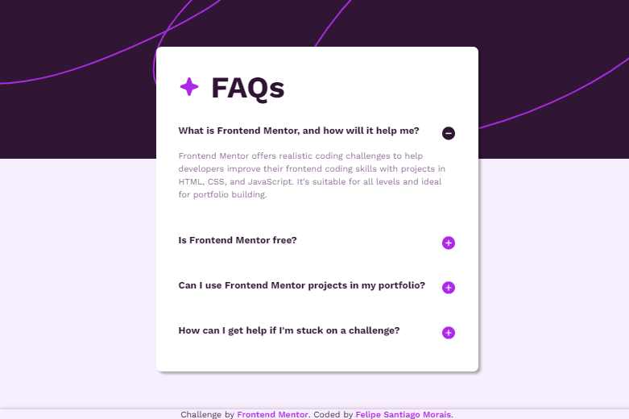

# Solução do desafio Frontend Mentor - FAQ Accordion

🧾✍ Essa é uma solução do desafio do [Frontend Mentor - FAQ Accordion](https://www.frontendmentor.io/challenges/faq-accordion-wyfFdeBwBz).


## Sumário

- [Visão Geral](#visão-geral)
  - [O desafio](#o-desafio)
  - [Screenshot e gifs](#screenshot-e-gifs)
- [Meu processo](#meu-processo)
  - [Tecnologias utilizadas](#tecnologias-utilizadas)
  - [Funcionalidade do projeto](#funcionalidade-do-projeto)
  - [Desenvolvimento contínuo](#desenvolvimento-contínuo)
  - [Agradecimentos](#agradecimentos)
  - [Recursos úteis](#recursos-úteis)
- [Autor](#autor)


## Visão-geral

### O desafio

Objetivos:

- Esconder/mostrar a resposta para uma pergunta quando essa pergunta é clicada
- ver o layout ideal para a interface dependendo do tamanho da tela do dispositivo
- Ver o ```hover``` e estados de foco para todos os elementos interativos na página.

### Screenshot e gifs

#### Funcionalidade do projeto



#### Responsividade do projeto



## Meu processo

### Tecnologias utilizadas

- JavaScript
- HTML5
- CSS3

### Funcionalidade do projeto

A funcionalidade do projeto é simples, primeiramente é necessário coletar todas as perguntas que foram colocadas em uma ```<div>``` cada.

```js
const faqs = document.querySelectorAll(".faq")
```

Em seguida, foi utilizado o método ```forEach``` para que haja uma conferência se aquela pergunta foi clicada, para, em seguida, adicionarmos a classe ```.selected``` àquele elemento que iria mostrar a resposta.

```js
faqs.forEach(question => {
    question.addEventListener("click", () => {
        const faqSelected = document.querySelector(".selected");
        if (faqSelected) {
            if (faqSelected === question) {
                faqSelected.classList.toggle("selected")
            } else {
                faqSelected.classList.toggle("selected");
                question.classList.toggle("selected");
            }
        } else {
            question.classList.toggle("selected")
        }
    })
})
```

```css
.content .faq .answer {
    margin-top: 2.5rem;
    line-height: 150%;
    color: var(--answer-color);
    height: 0;
    overflow: hidden;
    font-weight: 400;
    transition: .5s;
}

.container .faq.selected .answer {
    height: 12rem;
}
```

Basicamente, ao adicionarmos essa classe, o parágrafo que contêm a resposta à pergunta receberia uma altura de ```height: 12rem``` que, anteriormente possuia uma altura nula ```height: 0```. Além disso, escondemos todo o excesso de elemento transbordante do parágrafo com ```overflow: hidden```. Ou seja, tudo que "transbordar" uma altura no valor zero, seria escondido, ou seja, todo ele. Ao clicarmos na pergunta simplesmente o elemento recebe altura o suficiente para mostrar todo o conteúdo da resposta.

Por fim, ao adicionarmos uma transição ao elemento de resposta, ao ser aberto ele abre de forma suave e, dessa forma, favorece a estética do site.

```css
.content .faq .answer {
    transition: .5s;
}
```

### Desenvolvimento contínuo

Esse projeto, apesar de simples, é mais uma forma de praticarmos JS, além do cuidado com a formatação do código e estética do projeto concluido. Mais um desafio concluido do [Frontend Mentor](https://www.frontendmentor.io).

### Recursos úteis

- [Responsive Viewer](https://chromewebstore.google.com/detail/responsive-viewer/inmopeiepgfljkpkidclfgbgbmfcennb) - Essa extensão do navegador nos ajuda a visualizar o projeto através das telas dos diversos dispositivos, assim, melhorar a responsividade. 
- [Auto rename tag](https://marketplace.visualstudio.com/items?itemName=formulahendry.auto-rename-tag) - Com essa extensão do VSCode é possível alterar, simultaneamente, o valor das tags HTML na sua abertura e fechamento, assim o processo de desenvolvimento do código é acelerado.
- [Live Server](https://marketplace.visualstudio.com/items?itemName=ritwickdey.LiveServer) - Extensão do VSCode que transmite automaticamente no navegador as alterações feitas no projeto, dispensando a necessidade de atualização da página.
- [Color HighLight](https://marketplace.visualstudio.com/items?itemName=naumovs.color-highlight) - Faz com que as cores escritas em RGB, RGBA, HSL e outros fiquem coloridas com a cor que as define. Assim facilita visualmente a seleção de cores no CSS.
- [Responsive Viewer](https://chromewebstore.google.com/detail/responsive-viewer/inmopeiepgfljkpkidclfgbgbmfcennb?pli=1) - Essa extensão de navegador nos permite visualizarmos o projeto de acordo com as diversas resoluções de tela. Dessa forma, nos proporciona uma responsividade adequada a todas as interfaces dos usuários.

## Autor

- GitHub - [Felipe Santiago Morais](https://github.com/SantiagoMorais)
- Linkedin - [Felipe Santiago](https://www.linkedin.com/in/felipe-santiago-873025288/)
- Frontend Mentor - [@FelipeSantiagoMorais](https://www.frontendmentor.io/profile/SantiagoMorais)
- Instagram - [@felipe.santiago.morais](https://www.instagram.com/felipe.santiago.morais)
